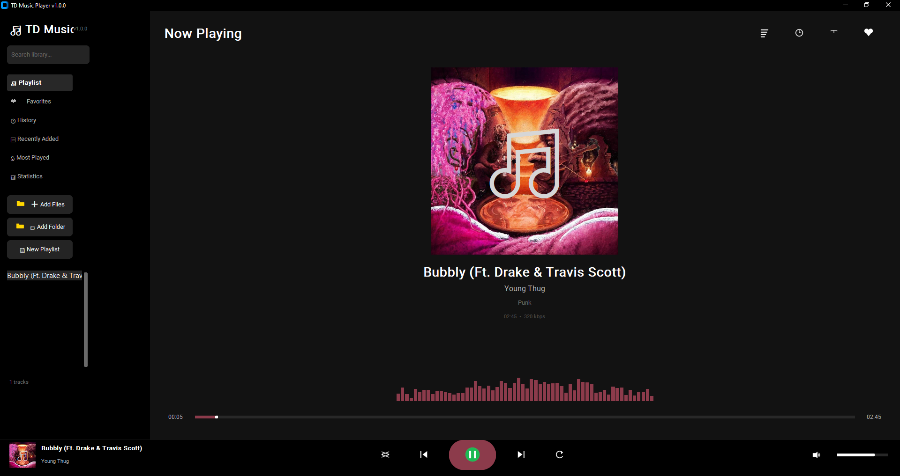

<div align="center">



# 🎵 TD Music Player

### *The Ultimate Open-Source Desktop Music Experience*

[](https://python.org)
[](LICENSE)
[](https://github.com/Taha-Azadi/TD-Music-Player)
[](https://github.com/Taha-Azadi/TD-Music-Player/releases)
[](https://github.com/Taha-Azadi/TD-Music-Player/stargazers)

[🚀 Getting Started](#-getting-started) • [✨ Features](#-features) • [📸 Screenshots](#-screenshots) • [🗺️ Roadmap](#-roadmap) • [🤝 Contributing](#-contributing)

</div>

---

## 🌟 Why TD Music Player?

TD Music Player is not just another music player — it is a **complete desktop audio ecosystem** built from the ground up with modern Python technologies. Designed for audiophiles, developers, and everyday users who demand both beauty and functionality.

> 🎯 **Mission**: To create the most feature-rich, extensible, and beautiful open-source music player in the Python ecosystem.

---

## ✨ Features

### 🎨 Visual Experience
| Feature | Description |
|---------|-------------|
| **Dynamic Theming** | UI accent colors are automatically extracted from album artwork in real-time |
| **Real-time Visualizer** | 60-bar spectrum analyzer that reacts to your music |
| **Modern Dark UI** | Premium Spotify-inspired interface built with `customtkinter` |
| **Toast Notifications** | Elegant, non-intrusive floating notifications |
| **Glassmorphism Ready** | UI elements support transparency and blur effects |

### 🎵 Playback Engine
| Feature | Description |
|---------|-------------|
| **Shuffle & Repeat** | Smart shuffle with play history + 3 repeat modes (Off / All / One) |
| **Sleep Timer** | Auto-stop playback after a specified duration |
| **Playback Speed** | Variable speed control from **0.5x to 2.0x** |
| **Seekable Timeline** | Click anywhere on the progress bar to jump instantly |
| **Volume Control** | Smooth slider with one-click mute toggle |
| **Gapless Playback** | Seamless transitions between tracks *(planned v1.1.0)* |

### 📂 Library Management
| Feature | Description |
|---------|-------------|
| **SQLite Database** | Persistent storage for tracks, history, favorites, and playlists |
| **Smart Search** | Real-time filtering across title, artist, album, and genre |
| **Favorites** | One-click ❤️ to save tracks permanently |
| **Listening History** | Complete log of every track you have played |
| **Statistics Dashboard** | Total plays, duration, track count, and more |
| **Recently Added** | Auto-track and display newly imported music |
| **Most Played** | Smart recommendations based on your listening habits |
| **Custom Playlists** | Create, rename, and manage unlimited playlists |
| **Auto-Scan Folders** | Automatically detect new music in watched directories |

### 📜 Lyrics Support
| Feature | Description |
|---------|-------------|
| **LRC File Support** | Display synchronized lyrics from `.lrc` files |
| **Auto-Detection** | Automatically loads lyrics file with the same name as the track |
| **Inline Display** | Clean, scrollable lyrics panel inside the player |

### ⌨️ Keyboard Shortcuts

| Key | Action | Key | Action |
|-----|--------|-----|--------|
| `Space` | Play / Pause | `M` | Mute Toggle |
| `←` | Previous Track | `S` | Shuffle Toggle |
| `→` | Next Track | `R` | Repeat Toggle |
| `↑` | Volume Up | `L` | Toggle Lyrics Panel |
| `↓` | Volume Down | `F` | Add to Favorites |
| `Ctrl + O` | Add Files | `Ctrl + N` | New Playlist |
| `Ctrl + Q` | Quit Application | | |

### 🔔 System Integration
| Feature | Description |
|---------|-------------|
| **System Tray** | Minimize to tray with full playback controls |
| **Media Keys** | Support for keyboard media keys *(planned v1.1.0)* |
| **Auto-generated Icons** | All 18+ UI icons are generated at runtime — no external assets needed |


---

## 🚀 Getting Started

### Prerequisites
- Python **3.8** or higher
- Windows / macOS / Linux

### Installation

#### Option 1: Quick Start (Recommended)

```bash
# Clone the repository
git clone https://github.com/Taha-Azadi/TD-Music-Player.git
cd TD-Music-Player

# Install dependencies
pip install -r requirements.txt

# Run the player
python main.py
```

#### Option 2: Install as Package

```bash
# Clone and install
git clone https://github.com/Taha-Azadi/TD-Music-Player.git
cd TD-Music-Player
pip install -e .

# Run from anywhere
td-music
```

#### Option 3: Using Poetry (Advanced)

```bash
git clone https://github.com/Taha-Azadi/TD-Music-Player.git
cd TD-Music-Player
poetry install
poetry run td-music
```

---

## 📝 How to Add Lyrics

TD Music Player supports **LRC (LyRiCs)** format for synchronized lyrics.

### Step 1: Create an LRC file
Create a text file with the **exact same name** as your audio file, but with `.lrc` extension.

**Example:**
```
📁 Music/
   ├── Adele - Hello.mp3
   └── Adele - Hello.lrc   ← Lyrics file
```

### Step 2: Add timestamps
Use the format `[mm:ss.xx]` for each line:

```lrc
[00:00.00]Hello, it's me
[00:05.20]I was wondering if after all these years
[00:10.50]You'd like to meet
[00:15.00]To go over everything
[00:20.80]They say that time's supposed to heal ya
```

### Step 3: Enjoy
The lyrics will automatically load when you play the track. Press `L` to toggle the lyrics panel.

> 💡 **Tip**: Save your `.lrc` files with **UTF-8** encoding to support Persian, Arabic, and other languages.

---

## 🗺️ Roadmap

Our vision is to make TD Music Player the most powerful open-source music player available. Here is what is coming:

### ✅ Released — v1.0.0 (Current)
- [x] Modern dark UI with customtkinter
- [x] Dynamic theming from album art
- [x] Real-time audio visualizer
- [x] SQLite database (tracks, history, favorites)
- [x] Smart search and filtering
- [x] Playlist management
- [x] Lyrics viewer (LRC support)
- [x] Sleep timer & playback speed
- [x] System tray integration
- [x] Keyboard shortcuts
- [x] Auto-generated UI icons
- [x] Cross-platform support

### 🔜 v1.0.1 — Stability & Polish *(ETA: August 2026)*
- [ ] Drag & Drop file support into the player window
- [ ] Mini player mode (compact floating window)
- [ ] M3U playlist import/export
- [ ] Audio equalizer (10-band)
- [ ] Track rating system (1-5 stars)
- [ ] Better error handling and crash recovery
- [ ] Persian/Arabic text rendering improvements
- [ ] Auto-update checker

### 🔜 v1.0.2 — Enhanced Library *(ETA: September 2026)*
- [ ] Folder watcher (auto-detect new music)
- [ ] Duplicate track detection
- [ ] Bulk metadata editor (tag editor)
- [ ] Album view mode (grid of album covers)
- [ ] Artist view mode (group by artist)
- [ ] Genre filtering and browsing
- [ ] Year-based filtering
- [ ] Smart playlists (auto-generated rules)

### 🔜 v1.1.0 — Audio Enhancements *(ETA: October 2026)*
- [ ] Gapless playback
- [ ] Crossfade between tracks (configurable duration)
- [ ] ReplayGain volume normalization
- [ ] Audio effects (reverb, bass boost)
- [ ] Media key support (keyboard play/pause/next)
- [ ] WASAPI/ASIO exclusive mode (Windows)
- [ ] Output device selection

### 🔜 v1.2.0 — Online Features *(ETA: November 2026)*
- [ ] Last.fm scrobbling integration
- [ ] Fetch metadata from MusicBrainz
- [ ] Download album art from online sources
- [ ] Fetch lyrics from online APIs (LRCLIB, etc.)
- [ ] YouTube Music / Spotify import (playlist sync)

### 🔜 v1.3.0 — Advanced Features *(ETA: December 2026)*
- [ ] Podcast support (RSS feed parsing)
- [ ] Audio converter (transcode formats)
- [ ] CD ripping support
- [ ] Android remote control app
- [ ] Web interface (control from browser)
- [ ] Plugin system for third-party extensions

### 🔮 v2.0.0 — The Future *(ETA: 2027)*
- [ ] Completely rewritten audio engine (FFmpeg-based)
- [ ] Video playback support (music videos)
- [ ] Cloud sync (Google Drive / Dropbox)
- [ ] AI-powered recommendations
- [ ] Voice control integration
- [ ] Native mobile apps (iOS / Android)

---

## 📁 Project Structure

```
TD-Music-Player/
├── 📄 main.py                          # Entry point
├── 📄 setup.py                         # Package installer
├── 📄 pyproject.toml                   # Modern Python packaging
├── 📄 requirements.txt                 # Dependencies
├── 📄 LICENSE                          # MIT License
├── 📄 README.md                        # This file
├── 📄 CHANGELOG.md                     # Version history
├── 📄 .gitignore                       # Git ignore rules
│
├── 📦 td_music_player/                 # Main package
│   ├── __init__.py                     # Package metadata
│   ├── main.py                         # GUI application (800+ lines)
│   ├── music_player.py                 # Audio engine (pygame)
│   │
│   ├── 📂 core/                        # Backend systems
│   │   ├── database.py                 # SQLite persistence layer
│   │   ├── settings.py                 # JSON configuration
│   │   └── logger.py                   # Logging system
│   │
│   ├── 📂 ui/                          # User interface
│   │   ├── components.py               # Reusable widgets
│   │   ├── visualizer.py               # Spectrum animation
│   │   ├── lyrics_viewer.py            # Lyrics display
│   │   └── theme_manager.py            # Dynamic color extraction
│   │
│   ├── 📂 utils/                       # Utilities
│   │   ├── image_gen.py                # Runtime icon generation (18 icons)
│   │   ├── metadata.py                 # Audio tag extraction
│   │   └── helpers.py                  # Formatting & color tools
│   │
│   └── 📂 assets/                      # Auto-generated at runtime
│       ├── icon.png
│       ├── play.png
│       ├── pause.png
│       ├── ... (18 total icons)
│       └── empty_cover.jpg
│
├── 📂 docs/                            # Documentation
└── 📂 tests/                           # Unit tests
```

---

## 🛠️ Supported Audio Formats

| Format | Extension | Metadata | Cover Art | Lyrics |
|--------|-----------|----------|-----------|--------|
| MP3 | `.mp3` | ✅ ID3v1/v2 | ✅ | ✅ |
| FLAC | `.flac` | ✅ Vorbis Comments | ✅ | ✅ |
| OGG Vorbis | `.ogg` | ✅ Vorbis Comments | ❌ | ✅ |
| WAV | `.wav` | ✅ | ❌ | ✅ |
| M4A / AAC | `.m4a` | ✅ MP4 | ✅ | ✅ |
| WMA | `.wma` | ✅ ASF | ❌ | ✅ |
| OPUS | `.opus` | ✅ | ❌ | ✅ |

---

## ⚙️ Configuration

Settings are stored in:
- **Config**: `~/.td_music/config.json`
- **Database**: `~/.td_music/library.db`
- **Logs**: `~/.td_music/td_music.log`

### Default Config (`config.json`)

```json
{
  "volume": 0.7,
  "shuffle": false,
  "repeat": 0,
  "theme": "dark",
  "accent_color": "#1DB954",
  "show_visualizer": true,
  "playback_speed": 1.0,
  "auto_scan": true,
  "window_geometry": "1350x900"
}
```

---

## 🤝 Contributing

We love contributions! Whether it is bug fixes, new features, documentation, or translations — all contributions are welcome.

### How to Contribute

1. **Fork** the repository
2. **Clone** your fork:
   ```bash
   git clone https://github.com/YOUR_USERNAME/TD-Music-Player.git
   ```
3. **Create** a feature branch:
   ```bash
   git checkout -b feature/amazing-feature
   ```
4. **Commit** your changes:
   ```bash
   git commit -m "feat: add amazing feature"
   ```
5. **Push** to your fork:
   ```bash
   git push origin feature/amazing-feature
   ```
6. **Open** a Pull Request

### Contribution Guidelines
- Follow PEP 8 style guide
- Write meaningful commit messages
- Add docstrings to new functions
- Update README.md if needed
- Test your changes before submitting

---

## 🐛 Bug Reports & Feature Requests

Found a bug or have an idea?

- 🐛 [Open an Issue](https://github.com/Taha-Azadi/TD-Music-Player/issues/new?template=bug_report.md)
- 💡 [Request a Feature](https://github.com/Taha-Azadi/TD-Music-Player/issues/new?template=feature_request.md)
- 💬 [Start a Discussion](https://github.com/Taha-Azadi/TD-Music-Player/discussions)

---

## 📜 License

This project is licensed under the **MIT License** — see the [LICENSE](LICENSE) file for details.

```
MIT License

Copyright (c) 2026 Taha Azadi

Permission is hereby granted, free of charge, to any person obtaining a copy
of this software and associated documentation files (the "Software"), to deal
in the Software without restriction, including without limitation the rights
to use, copy, modify, merge, publish, distribute, sublicense, and/or sell
copies of the Software, and to permit persons to whom the Software is
furnished to do so, subject to the following conditions:

The above copyright notice and this permission notice shall be included in all
copies or substantial portions of the Software.
```

---

## 🙏 Acknowledgments

Special thanks to the incredible open-source projects that make TD Music Player possible:

- **[CustomTkinter](https://github.com/TomSchimansky/CustomTkinter)** — Modern, customizable tkinter widgets
- **[Pygame](https://www.pygame.org/)** — Cross-platform audio playback
- **[Mutagen](https://mutagen.readthedocs.io/)** — Powerful audio metadata handling
- **[Pillow](https://python-pillow.org/)** — Python Imaging Library
- **[pystray](https://github.com/moses-palmer/pystray)** — System tray integration

---

<div align="center">

### ⭐ Star this repo if you like it!

**[🐙 GitHub](https://github.com/Taha-Azadi/TD-Music-Player)** • **[📥 Releases](https://github.com/Taha-Azadi/TD-Music-Player/releases)** • **[🐛 Issues](https://github.com/Taha-Azadi/TD-Music-Player/issues)**

Made with ❤️ by **[Taha Azadi](https://github.com/Taha-Azadi)**

</div>
